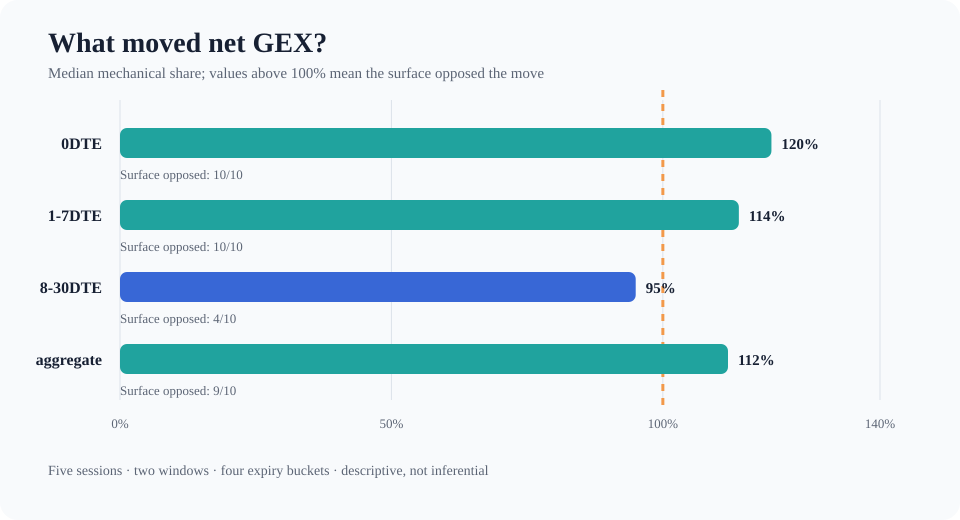
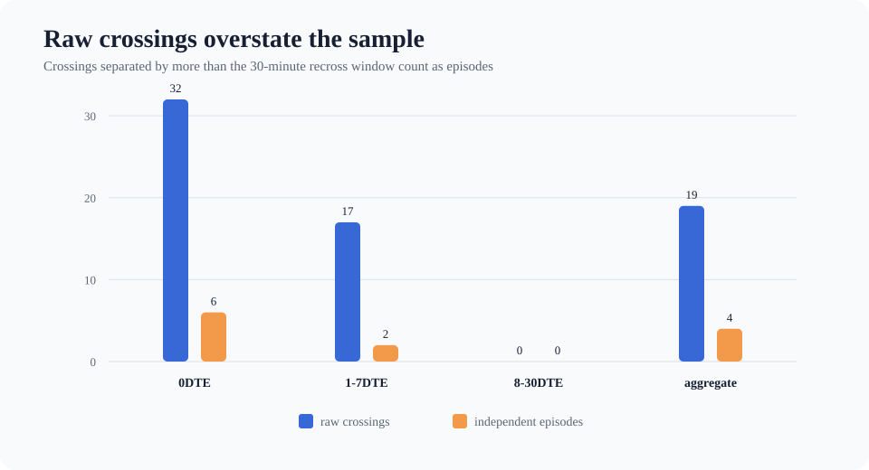

# GEX Market Structure Lab

A transparent, test-driven research pipeline for studying SPX/SPXW gamma
exposure (GEX) and separating intraday changes into:

- **mechanical effects** from spot movement and time decay; and
- **surface effects** from implied-volatility repricing.

The project began as a five-session observational study conducted from
2026-07-27 through 2026-07-31. The public release preserves the methodology,
core calculation engine, tests, research log, and aggregate results while
excluding licensed raw option-chain data and machine-specific automation.

> This is research software, not a trading signal, a dealer-positioning feed,
> or investment advice. Dealer sign is assumed, not observed.



## Research question

If open interest is held fixed during the session, how much of an observed GEX
change is explained by spot/time mechanics, and how much is explained by a
repriced IV surface?

The study represents four counterfactual states:

```text
                       surface at t0       surface at t1
spot/time at t0              A                   C
spot/time at t1              B                   D
```

The code reports an order-independent Shapley attribution and enforces the
identity

```text
mechanical contribution + surface contribution = D - A
```

for every reported row. This is a model-based counterfactual attribution, not
a causal decomposition.

## Main findings

Across 40 attribution rows (five sessions × two intraday windows × four expiry
buckets):

- Median mechanical share of the net-GEX change was **114%**.
- Surface repricing opposed the mechanical move in **33 of 40** rows.
- In both 0DTE and 1–7DTE, surface repricing opposed the move in **10 of 10**
  observations.
- For the gamma flip, the relationship reversed: the median absolute surface
  contribution was **5.76 points**, versus **1.08 points** mechanically.
- Roughly 80% of observed flip crossings reversed within 30 minutes; counting
  independent crossing episodes instead of raw crossings changed the estimated
  sample requirement from days to several weeks.
- The 0DTE flip was not stable enough to treat as a single well-defined level:
  shallow curves, multiple roots, and rapid repricing all mattered.



These results are descriptive. Five sessions are not enough for statistical
inference, and the final report records three early hypotheses that failed to
replicate.

## What is reproducible publicly

The repository has two reproducibility layers:

1. **Deterministic offline pipeline** — a synthetic option-chain provider runs
   capture, normalization, frozen-map construction, actual-map construction,
   and attribution without credentials or network access.
2. **Published aggregate evidence** — compact CSV tables in
   `data/public_results/` reproduce the headline tables and figures without
   redistributing vendor data.

The original raw chains are intentionally absent. They were obtained from a
licensed provider and are not required to run the synthetic test suite.

## Quick start

Python 3.11+ is recommended.

```bash
python -m venv .venv
source .venv/bin/activate
python -m pip install -r requirements.txt
pytest -q
python scripts/run_synthetic_demo.py
```

The demo is deterministic and offline. It writes only beneath the repository's
ignored `data/raw_chain/`, `data/normalized/`, and `data/derived/` directories.
Run `python scripts/run_synthetic_demo.py --clean` to replace a prior demo run.

Regenerate the README figures using only Python's standard library:

```bash
python scripts/build_public_figures.py
```

## Repository guide

```text
src/spx_gex/                 core GEX, flip, map, and attribution logic
tests/                       unit and end-to-end synthetic tests
config/experiment.yaml       frozen experiment assumptions and conventions
data/public_results/         publishable aggregate result tables
data/manual_input/           synthetic spot path used by the offline demo
assets/                      generated public figures
docs/FINAL_REPORT.md         full conclusions and retractions
docs/METHODOLOGY.md          design decisions and validation logic
docs/KNOWN_LIMITATIONS.md    boundaries of the measurement
docs/T*_SUMMARY_*.md         contemporaneous daily research log
```

## Methodological guardrails

- Open interest is fixed to the prior session; intraday inventory changes are
  unobserved.
- Calls are assigned positive dealer GEX and puts negative dealer GEX. This is
  an explicit convention, not a measurement of dealer books.
- A single common contract set is used across all four attribution states.
- Multiple flip roots are retained; the solver never averages them.
- Impossible vendor greeks are flagged and excluded, and the cost of filtering
  is reported rather than silently repaired.
- A capture's as-of time is distinct from its download time.
- Undefined values remain undefined; missing data is not converted to zero.

See [the methodology](docs/METHODOLOGY.md) and
[known limitations](docs/KNOWN_LIMITATIONS.md) for the complete treatment.

## Data and licensing

The source code is released under the MIT License. The license does not grant
rights to third-party market data. This public version contains only synthetic
fixtures, author-created aggregate tables, and research documentation. See
[`data/README.md`](data/README.md) for the data boundary.

## Historical provider adapter

The original experiment used Massive's delayed options tier. Its adapter is
retained for transparency, but the public configuration defaults to the
synthetic provider. Live use is optional, requires `MASSIVE_API_KEY`, and is
subject to the provider's current terms and entitlements.

## Further reading

- [Final report](docs/FINAL_REPORT.md)
- [Observation framework](docs/FRAMEWORK.md)
- [Original specification](docs/SPEC.md)
- [Publication audit](docs/PUBLICATION_AUDIT.md)

## License

Code: [MIT](LICENSE). Third-party data: not included and not relicensed.
